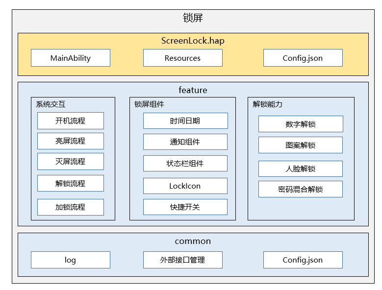

# 锁屏<a name="ZH-CN_TOPIC_0000001103330836"></a>

-   [简介](#section11660541593)
    -   [架构图](#section125101832114213)
-   [目录](#section161941989596)
-   [相关仓](#section1371113476307)

## 简介<a name="section11660541593"></a>

锁屏应用是OpenHarmony中预置的系统应用，为用户提供锁屏的基础能力，提供滑动解锁，密码解锁等解锁能力，以及锁屏页面的信息展示。

### 架构图<a name="section125101832114213"></a>



## 目录<a name="section161941989596"></a>

```
/applications/standard/screenlock
    ├── build.gradle                    # 全局编译配置文件
    ├── settings.gradle                 # 编译模块配置文件
    ├── LICENSE                         # 许可文件
    ├── common                          # 通用工具类目录
    ├── signature                       # 证书文件目录
    ├── features                        # 子组件目录
    │   ├── batterycomponent            # 电池组件
    │   ├── noticeitem                  # 通知子组件
    │   ├── notificationservice         # 通知服务组件
    │   ├── screenlock                  # 锁屏组件
    │       ├── common                  # 通用工具
    │       ├── model                   # 数据管理
    │       ├── view                    # 组件样式管理
    │       ├── vm                      # 数据样式绑定管理
    ├── product                         # 锁屏总体功能目录
    │   ├── pc                          # 模块目录
    │       ├── pages/slidesrceenlock   # 滑动锁屏  
    │   ├── phone                       # 模块目录
    │       ├── pages/slidesrceenlock   # 滑动锁屏  
```

## 相关仓<a name="section1371113476307"></a>

系统应用

**applications\_screenlock**

